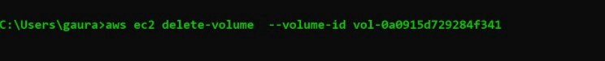

# ***Launching AWS Instance with CLI***

<p align="center">

</p>

> ## ***Task Description:***
🔷 ***Create a key pair***
🔷 ***Create a security group***
🔷 ***Launch an instance using the above created key pair and security group.***
🔷 ***Create an EBS volume of 1 GB.***
🔷 ***The final step is to attach the above created EBS volume to the instance you created in the previous steps.***

## ***Prerequisite:***
<b><i>
1. We need to install the Aws cli program you can install it from here
2. Now when we have installed the program we need to authenticate yourself so that we can use our AWS Account for this purpose we use “aws configure” command
3. Enter your Access key , security key and region so that we can access the account
</i></b>

```
C:\Users\gaura>aws configure
AWS Access Key ID [****************CNVX]:
AWS Secret Access Key [****************aeFy]:
Default region name [ap-south-1]:
Default output format [None]:
```

## ***Let’s Begin***

<b><i>
🔰 Create a key pair
First we will create a key-pair with the name Key_cli

```
aws ec2 create-key-pair --key-name Key_cli
```
<p align="center">

</p>

🔰 Create a security group with the name CLI-SG and giving the description is must here I have gave it as created-over-cli

```
aws ec2 create-security-group — description created-over-cli — group-name CLI-SG
```
<p align="center">

</p>

we can also add the firewalld rules over the Security Group

<p align="center">

</p>

## ***Let’s Check***

<p align="center">

</p>

🔰 Now we will Launch an instance using the above created key pair and security group.

```
aws ec2 run-instances --image-id  ami-0e306788ff2473ccb --instance-type t2.micro --count 1 --subnet-id subnet-8ad2e8e2 --security-group-ids sg-01f40659fc854126b  --key-name Key_cli
```

<p align="center">

</p>

#### Let’s Check the Instance required info

<p align="center">

</p>

🔰 Create an EBS volume of 1 GB.

```
aws ec2 create-volume  --availability-zone ap-south-1a --size 1 --volume-type gp2
```
<p align="center">

</p>

🔰 The final step is to attach the above created EBS volume to the instance you created in the previous steps.

```
aws ec2 attach-volume  --device /dev/xvdb --instance-id i-058afe3aa84b04a1b --volume-id vol-0a0915d729284f341
```
<p align="center">

</p>
<p align="center">

</p>

So now we have we have successfully performed the task 🎖🎖🙌

💎 Lets Clean the environment
So we have to detach the volume we attached, Delete that volume, Terminate the instance launched and at the last delete the security group and the key-pair

<p align="center">

</p>
<p align="center">

</p>

<p align="center">

</p>

<p align="center">

</p>

<p align="center">

</p>

<p align="center">

</p>

<p align="center">

</p>

### ***Thank You For Reading ……***
## ***Feel Free to Drop any kind of suggestions and queries they are always welcome : [Here](https://www.linkedin.com/in/pagare-gaurav/)*** </b></i> **😊**
